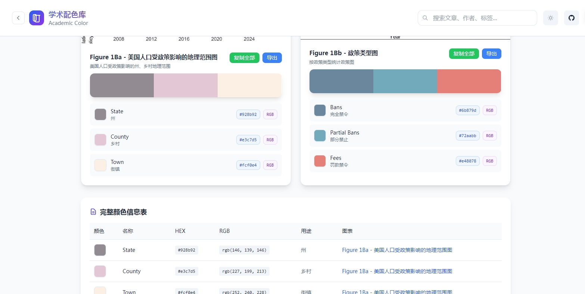
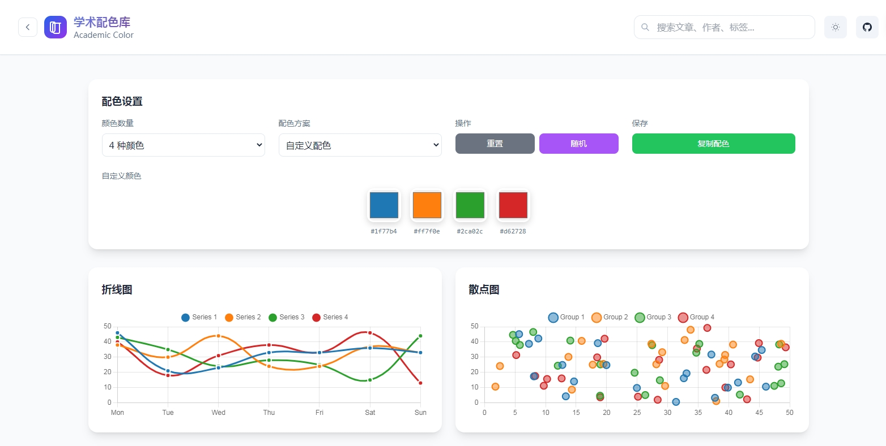
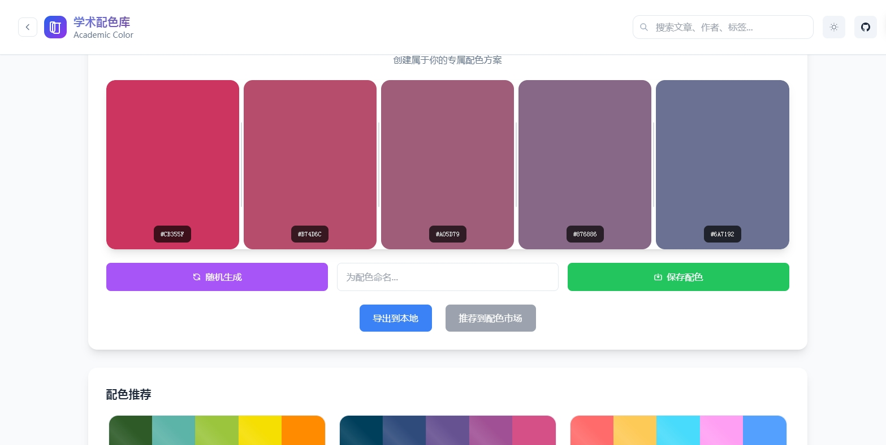

# 学术配色库 Academic Color Palettes

一个专为学术研究和科学可视化设计的配色方案库，收录来自顶级期刊的精美图表配色。


## ✨ 主要特性

-  **精选配色** - 收录 Nature、Science、Cell 等顶级期刊的图表配色
-  **智能筛选** - 按研究领域、发表年份、颜色数量快速筛选
-  **一键复制** - 支持 HEX、RGB 格式，一键复制到剪贴板
-  **实时预览** - 内置图表预览工具，实时查看配色效果
-  **深色模式** - 支持明暗主题切换，保护视力
-  **响应式** - 完美适配桌面端和移动端

## 🚀 快速开始

### 在线使用
直接访问：[https://rookie-00001.github.io/Academic-Color](https://rookie-00001.github.io/Academic-Color)

### 本地部署
```bash
# 克隆项目
git clone https://github.com/Rookie-00001/Academic-Color.git

# 进入目录
cd academic-color

# 使用任意 HTTP 服务器运行
python -m http.server 8000
# 或者
npx serve .

# 打开浏览器访问
open http://localhost:8000
```

## 🎯 核心功能

### 配色浏览

- 按研究领域分类浏览
- 详细的配色信息和使用说明
- 原始图表预览

### 配色预览工具

- 折线图、散点图、柱状图、饼图预览
- 自定义颜色数量和配色方案
- 实时效果预览

### 我的配色

- 创建个人配色方案
- 随机配色生成
- 导出和分享功能

## 📊 数据来源

所有配色均来自公开顶级学术期刊，开源免费，如有侵权联系删除。

## 📁 项目结构

```
academic-color/
├── index.html              # 主页面
├── css/
│   ├── styles.css          # 主样式
│   ├── themes.css          # 主题样式
│   └── components.css      # 组件样式
├── js/
│   ├── main.js            # 主应用逻辑
│   ├── data-manager.js    # 数据管理
│   ├── ui-components.js   # UI 组件
│   ├── preview-tool.js    # 预览工具
│   └── my-palettes.js     # 个人配色
├── data/
│   ├── articles.json      # 文章数据
│   ├── journals.json      # 期刊数据
│   ├── fields.json        # 领域数据
│   └── images/            # 图表图片
└── README.md
```

## 🎨 使用示例

### 复制单个颜色
```javascript
// 点击颜色块自动复制 HEX 值
#1f77b4  // 复制到剪贴板
```

### 复制整套配色
```javascript
// 一键复制完整配色方案
#1f77b4, #ff7f0e, #2ca02c, #d62728, #9467bd
```

### 导出配色数据
```json
{
  "name": "Nature 细胞分类配色",
  "colors": [
    {"hex": "#1f77b4", "name": "T细胞", "usage": "主要细胞类型"},
    {"hex": "#ff7f0e", "name": "B细胞", "usage": "次要细胞类型"}
  ],
  "source": "Nature 2024"
}
```

##  贡献指南

欢迎贡献新的配色方案！

1. Fork 本项目
2. 创建特性分支 (`git checkout -b feature/new-color`)
3. 提交更改 (`git commit -am 'Add new color'`)
4. 推送到分支 (`git push origin feature/new-color`)
5. 创建 Pull Request

### 配色提交格式
```json
{
  "id": "unique_id",
  "title": "文章标题",
  "journal": "期刊名称",
  "year": 2024,
  "figures": [{
    "name": "图表名称",
    "colors": [
      {"hex": "#1f77b4", "name": "颜色名称", "usage": "用途说明"}
    ]
  }]
}
```

## 📄 许可证

MIT License - 详见 [LICENSE](LICENSE) 文件

##  致谢

- 感谢所有提供优秀配色方案的学术期刊
- 感谢开源社区的工具和库支持

##  联系

- **作者**: LjhaiDj
- **邮箱**: jc2973998021@163.com
- **GitHub**: [@Rookie-00001](https://github.com/Rookie-00001)

---

⭐ 如果这个项目对你有帮助，请给它一个星标！

[GitHub stars](https://img.shields.io/github/stars/Rookie-00001/Academic-Color?style=social)
[GitHub forks](https://img.shields.io/github/forks/Rookie-00001/Academic-Color?style=social)
[GitHub issues](https://img.shields.io/github/issues/Rookie-00001/Academic-Color?style=social)
[License](https://img.shields.io/github/license/Rookie-00001/Academic-Color)
